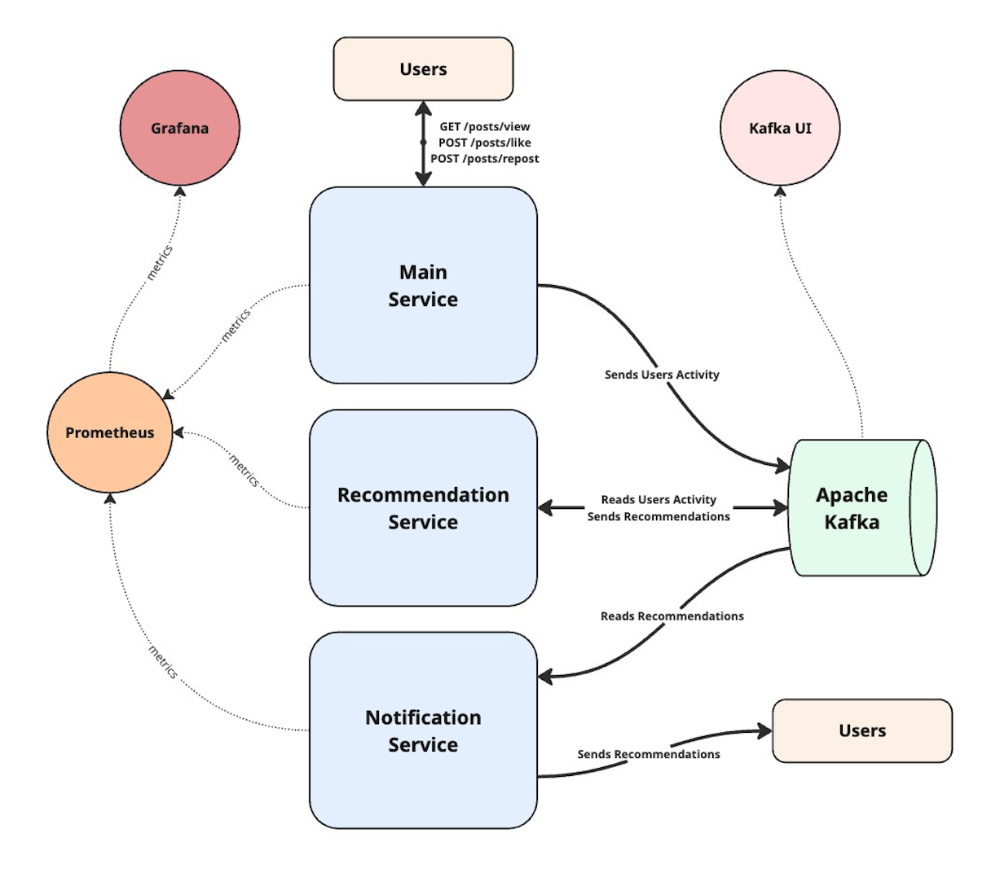

# Recommendation System

The system consisting of several microservices and a Kafka broker, emulating the operation of a recommendation system (creating/processing recommendations based on users activity).

This project focuses not on business logic and code, but on the system as a whole, the interaction between components and the infrastructure.

The entire system can be run using Docker or in a Kubernetes cluster. Prometheus and Grafana are used to store the metrics. Elasticsearch, Fluentbit and Kibana (EFK stack) are used for log collection, storage and analysis.

## Technologies and Tools
1. Java 25 and Spring Boot 4 for Microservices
2. Docker Compose
3. Kubernetes
5. Apache Kafka
6. Kafka GUI
7. Prometheus and Grafana for metrics
9. Elasticsearch, Fluentbit, Kibana (EFK stack) for logs

## System Components

 <strong> Main Service </strong> 

###### Technology
Java 25 / Spring Boot 4 Microservice
###### Description
Has few REST endpoints in order to emulate users activity:
> GET /posts/view

> POST /posts/like

> POST /posts/repost

When these endpoints are executed it sends messages into `recommendation-system.users-activity` Kafka topic with specific key (`view`, `like`, `repost`)
in order to separate them by partition.

 <strong> Recommendation Service </strong> 

###### Technology
Java 25 / Spring Boot 4 Microservice
###### Description
Emulates the generation of recommendations for users:
- Reads messages from the `recommendation-system.users-activity` Kafka topic about users activity
- Generates recommendations with different types and
- Sends messages with some information about recommendations to different partitions of a `recommendation-system.recommendations` Kafka topic.

 <strong> Notification Service </strong> 

###### Technology
Java 25 / Spring Boot 4 Microservice
###### Description
Emulates the generation and sending of notifications to users based on recommendations:
- Reads recommendations from the `recommendation-system.recommendations` Kafka topic
- 'Sends' notifications about recommendations to users.

 <strong> Kafka Broker </strong> 

###### Technology
A Docker container based on `apache/kafka:4.1.0` image
###### Description
Has few topics:
- `recommendation-system.users-activity` with 3 partitions for users activity types: views, likes, reposts;
- `recommendation-system.recommendations` with 3 partitions for different recommendations: news, new friends, interesting blog posts.

 <strong> Kafka GUI </strong> 

###### Technology
A Docker container based on `ghcr.io/kafbat/kafka-ui:v1.4.2` image
###### Description
UI for Apache Kafka message broker

 <strong> Prometheus </strong> 

###### Technology
A Docker container based on `prom/prometheus:v3.9.1` image

 <strong> Grafana </strong> 

###### Technology
A Docker container based on `grafana/grafana:12.3.2` image
###### Description
Allows to analyse metrics

 <strong> Elasticsearch </strong> 

###### Technology
A Docker container based on `elasticsearch:9.4.0` image
###### Description
Stores logs. Runs only in Kubernetes cluster

 <strong> Kibana </strong> 

###### Technology
A Docker container based on `kibana:9.4.0` image
###### Description
Allows to view and analyze logs stored in Elasticsearch

 <strong> Fluentbit </strong> 

###### Technology
A Docker container based on `fluent/fluent-bit:5.0` image
###### Description
Collects logs from containers and sends them to Elasticsearch

## Running the System in Kubernetes cluster using Minikube
### Prerequisites
1. Docker should be installed
2. Install and run Minikube
3. Run `minikube addons enable ingress` command
4. Build Project's images (see "Running the System using the Docker Compose" below)
5. Load that images into Minikube: `minikube image load <image>`

### Setting up the cluster
1. Apply Kubernetes cluster configuration: `kubectl apply -f k8s/ -R`
2. (Optional) On macOS run the command `minikube tunnel` in terminal
3. Add line `127.0.0.1 	recommendation-system.dev grafana.recommendation-system.dev kafka-ui.recommendation-system.dev` into `/etc/hosts` file.
Note: On Linux use minikube ip address returned from `minikube ip` command instead of `127.0.0.1`

After that the System components are available in a browser by:
- https://kafka-ui.recommendation-system.dev/ (Kafka UI)
- https://grafana.recommendation-system.dev/ (Grafana)
- https://kibana.recommendation-system.dev/ (Kibana)
- https://recommendation-system.dev/ (Main Service)

## Running the System using the Docker Compose

In order to run the system it is necessary to build microservices first:
> mvn clean package

Then the Docker images can be built:
> docker compose build [--no-cache]

And the full System can be launched:
> docker compose up -d

To shut down the system, run:
> docker compose down
